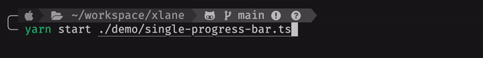
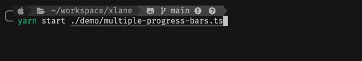
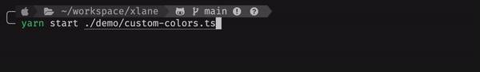

<div align="center">

# frogress-bar


React based progress bar for command-line/terminal applications

</div>

## Features

- 🌱 Simple & Easy to use
- 🔥 Supports single & multiple progress bar
- 🎨 Supports 256 & Truecolor
- 💧 Responsive size
- ⭐️ Fully customizable

## Installation

```bash
# npm
npm install frogress-bar

# yarn
yarn add frogress-bar
```

## Usage

```ts
import * as Frogress from 'frogress-bar';

// 1. Create new progress bar
const progressBar = Frogress.create({
  total: 100,
  template: '{label} {progress} ({percentage})',
  placeholder: {
    label: 'Downloader',
  },
});

// 2. Render progress bar
progressBar.start({ value: 0 });

await download({
  onProgress: (percent) => {
    // 3. Update progress bar state
    progressBar.update({ value: percent });
  },
});

// 4. Unmount progress bar#
progressBar.stop();

// 5. Remove progress bar
Frogress.remove(progressBar);
Frogress.removeAll();
```



<details>

  <summary>Multiple progress bars</summary>

[Demo](./demo/esm/multiple-progress-bars.mjs)



</details>

<details>

  <summary>Custom colored progress bars</summary>

[Demo](./demo/esm/custom-colors.mjs)



</details>

<details>

  <summary>Re-use progress bar</summary>

[Demo](./demo/esm/reuse-progress-bar.mjs)


</details>

## Documentation

### create

Create a new `ProgressBar` instance.
It can be called multiple times for multiple progress bars.

- Parameters
  | Name | Type | Required |
  |:--|:--|:--|
  | options | `ProgressConfig` | No |
- Return Value
  | Type |
  |:--|
  | `ProgressBar` |

```ts
/* interfaces */

interface ProgressConfig {
  /**
   * Defaults to `0`.
   */
  value?: number;
  /**
   * Defaults to `100`.
   */
  total?: number;
  /**
   * Defaults to `50` (Depend on terminal size).
   */
  progressBarSize?: number;
  /**
   * Defaults to `'█'`.
   */
  activeChar?: string;
  /**
   * Defaults to `'░'`.
   */
  inactiveChar?: string;
  /**
   * Template string.
   *
   * Defaults to `'{progress}'`.
   */
  template?: string;
  /**
   * Key-Value data that replace of template's placeholders.
   *
   * Defaults to `{}`.
   */
  placeholder?: Record<string, string>;
}

function create(config?: ProgressConfig): ProgressBar;
```

```ts
import * as Frogress from 'frogress-bar';

const progressBar = Frogress.create(config);
```

- `value`: Defaults to `0`.
- `total`: Defaults to `100`.
- `progressBarSize`: Defaults to `50` (Depend on terminal size).
- `activeChar`: Defaults to `'█'`.
- `inactiveChar`: Defaults to `'░'`.
- `template`: [Template](#template) string. Defaults to `'{progress}'`.
- `placeholder`: Key-Value data that replace of template's placeholders. Defaults to `{}`.

### remove

Unmount & Remove specified `ProgressBar` from current context.

- Parameters
  | Name | Type | Required |
  |:--|:--|:--|
  | progressBar | `ProgressBar` | Yes |
- Return Value
  | Type |
  |:--|
  | `void` |

```ts
/* interfaces */

function remove(progressBar: ProgressBar): void;
```

### removeAll

Unmount & Remove all progress bars from current context.

- Return Value
  | Type |
  |:--|
  | `void` |

```ts
/* interfaces */

function removeAll(): void;
```

### count

Returns the current instance count of the progress bar.

- Return Value
  | Type |
  |:--|
  | `number` |

```ts
/* interfaces */

function count(): number;
```

### setOptions

Applies the options to the Frogress container.

- Parameters
  | Name | Type | Required |
  |:--|:--|:--|
  | options | `ContainerOptions` | Yes |
- Return Value
  | Type |
  |:--|
  | `void` |

```ts
/* interfaces */

interface ContainerOptions {
  refreshRate: number;
}

function setOptions(options: ContainerOptions): void;
```

- `refreshRate`: Defaults to `50`.

### ProgressBar.start

Render progress bar.

- Parameters
  | Name | Type | Required |
  |:--|:--|:--|
  | options | `ProgressValues` | Yes |
- Return Value
  | Type |
  |:--|
  | `void` |

```ts
/* interfaces */

interface ProgressValues {
  value: number;
  total?: number;
  placeholder?: Record<string, string>;
}

function start(values: ProgressValues): void;
```

- `value`: current progress value.
- `total`: total progress value.
- `placeholder`: Key-Value data that replace of template's placeholders.

### ProgressBar.update

Set new states and re-render progress bar.

- Parameters
  | Name | Type | Required |
  |:--|:--|:--|
  | options | `ProgressValues` | Yes |
- Return Value
  | Type |
  |:--|
  | `void` |

```ts
/* interfaces */

interface ProgressValues {
  value: number;
  total?: number;
  placeholder?: Record<string, string>;
}

function update(values: ProgressValues): void;
```

- `value`: current progress value.
- `total`: total progress value.
- `placeholder`: Key-Value data that replace of template's placeholders.

### ProgressBar.stop

Unmount progress bar.

> [!NOTE]  
> If you want to exit the process, you should remove all of progress bars using [remove()](#remove) or [removeAll()](#removeall)

```ts
function stop(): void;
```

## Template

> [!WARNING]
> If you use reserved placeholder name, it will be overwritten to internal value of Frogress.

```ts
const templateString = 'Template {label} {progress} | {test}';

progressBar.update({
  placeholder: {
    // Plain placeholder
    label: '#1',
    // Placeholder with color
    test: Frogress.color('Colored!!', '#00ffff'),
  },
});

// Preview
// Template #1 ██████████████░░░░░░░░░░░░░░░░ | Colored!!
```

- Reserved placeholders
  - `{progress}`: Progress bar (required)
  - `{value}`: Current value
  - `{total}`: Total value
  - `{percentage}`: `current / total * 100`% value

## Development

```bash
# Lint
yarn lint

# Build
yarn build

# Run demo code
yarn start demo/{name}.ts
```

## Resources

- Logo image generated by [DALL-E](https://openai.com/index/dall-e-3)

## License

[MIT](./LICENSE)
